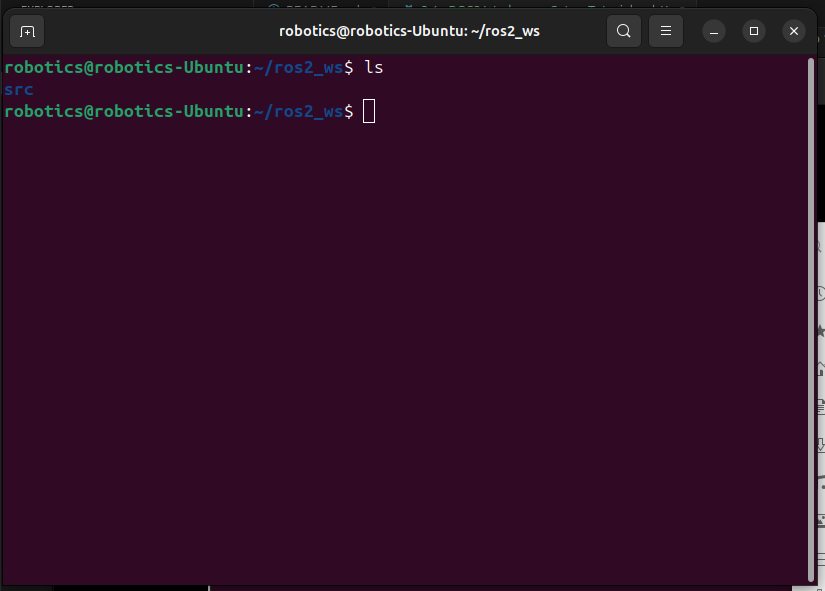
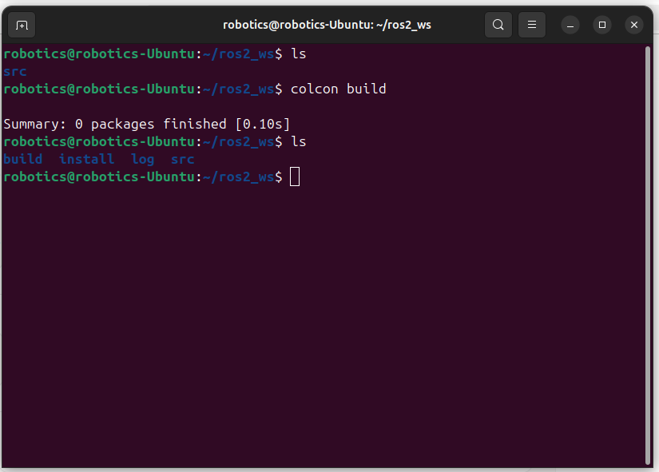
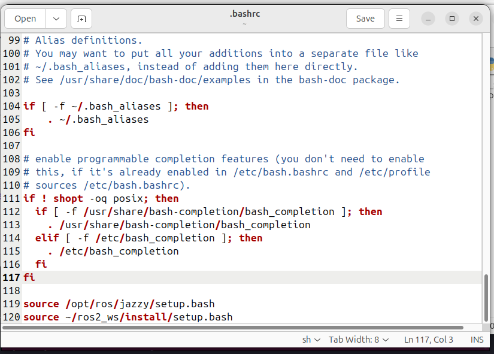

# ROS2 Workspace Setup Tutorial

This tutorial guides you through creating and setting up a ROS2 workspace, where you will develop, install, and compile code for ROS2 applications. A workspace is a directory that organizes your ROS2 packages and source code. This tutorial assumes you have ROS2 Jazzy installed and the `ros-dev-tools` package set up.

## Prerequisites

- **ROS2 Installation**: Ensure ROS2 Jazzy is installed. The installation directory is typically `/opt/ros/jazzy`.
- **ros-dev-tools**: Install the ROS2 development tools if not already installed. Run:
  ```bash
  sudo apt update
  sudo apt install ros-dev-tools
  ```
- **Terminal**: Use a terminal with `bash` (this tutorial uses `~/.bashrc` for configuration).

## Step 1: Create the Workspace Directory

1. **Navigate to the Home Directory**:
   Open a terminal and go to your home directory:
   ```bash
   cd ~
   ```

2. **Create the Workspace Directory**:
   Create a directory for your ROS2 workspace. The convention is to name it with a `_ws` suffix (e.g., `ros2_ws` for a generic workspace or `abc_ws` for an application named ABC). For this tutorial, use `ros2_ws`:
   ```bash
   mkdir ros2_ws
   ```

3. **Create the Source Directory**:
   Inside the workspace, create a `src` directory to hold your ROS2 packages and source code:
   ```bash
   cd ros2_ws
   mkdir src
   ```

   Your workspace structure should now look like:
   ```
   ~/ros2_ws/
   └── src/
   ```

   The `src` directory is where all your ROS2 package code will reside.

## Step 2: Build the Workspace

To compile and install packages in your workspace, use the `colcon` build tool. Follow these steps:

1. **Navigate to the Workspace Root**:
   Ensure you are in the `ros2_ws` directory (not inside `src`):
   ```bash
   cd ~/ros2_ws
   ```

2. **Run colcon build**:
   Build the workspace using:
   ```bash
   colcon build
   ```
   Since no packages are in the `src` directory yet, `colcon` will report zero packages built. The build process creates three new directories:
   - `build/`: Stores intermediate build files.
   - `install/`: Contains compiled binaries and scripts.
   - `log/`: Logs build-related information.

   After running `colcon build`, your workspace structure will look like:
   ```
   ~/ros2_ws/
   ├── build/
   ├── install/
   ├── log/
   └── src/
   ```

   If the `colcon` command fails, verify that `ros-dev-tools` is installed (see Prerequisites).

## Step 3: Source the Workspace

To use the packages in your workspace, you need to source the workspace’s `setup.bash` script, which sets up environment variables (e.g., `ROS2_PACKAGE_PATH`). The `install/` directory contains this script.

1. **Locate the Setup Script**:
   After building, check the `install/` directory:
   ```bash
   ls ~/ros2_ws/install
   ```
   You’ll see files like `setup.bash`, `local_setup.bash`, and others. Use `setup.bash` to source both the global ROS2 installation (`/opt/ros/jazzy`) and your workspace.

2. **Source the Setup Script**:
   Source the workspace’s `setup.bash` manually for the current terminal:
   ```bash
   source ~/ros2_ws/install/setup.bash
   ```

   Note: `local_setup.bash` only sources the workspace, not the global ROS2 installation. For simplicity, stick with `setup.bash`.

3. **Automate Sourcing with .bashrc**:
   To avoid sourcing manually every time, add the source command to your `~/.bashrc` file:
   ```bash
   gedit ~/.bashrc
   ```

   Add the following lines at the end of the file:
   ```bash
   source /opt/ros/jazzy/setup.bash
   source ~/ros2_ws/install/setup.bash
   ```

   **Important**: The order matters. Source the global ROS2 installation (`/opt/ros/jazzy/setup.bash`) first, then the workspace. This ensures the workspace overlays the global installation correctly.

   Save and close the file. To apply the changes in the current terminal, run:
   ```bash
   source ~/.bashrc
   ```

   Now, every new terminal will automatically source both the ROS2 installation and your workspace.

## Step 4: Verify the Setup

To confirm that your workspace is set up correctly:

1. Open a new terminal. The `~/.bashrc` changes should automatically source ROS2 and your workspace.
2. Run a ROS2 command, such as:
   ```bash
   ros2 pkg list
   ```
   This lists all available ROS2 packages, including any in your workspace (none yet, as the `src/` directory is empty).

If the command works without errors, your workspace is correctly set up.

## Next Steps

Your ROS2 workspace is now initialized and ready for development. In the next lessons, you can:
- Create ROS2 packages in the `src/` directory.
- Write nodes and other ROS2 components.
- Rebuild the workspace with `colcon build` after adding or modifying packages.
- Source the workspace’s `setup.bash` (already automated via `~/.bashrc`) to access new packages.

For further learning, refer to the official [ROS2 Documentation](https://docs.ros.org/en/jazzy/index.html).